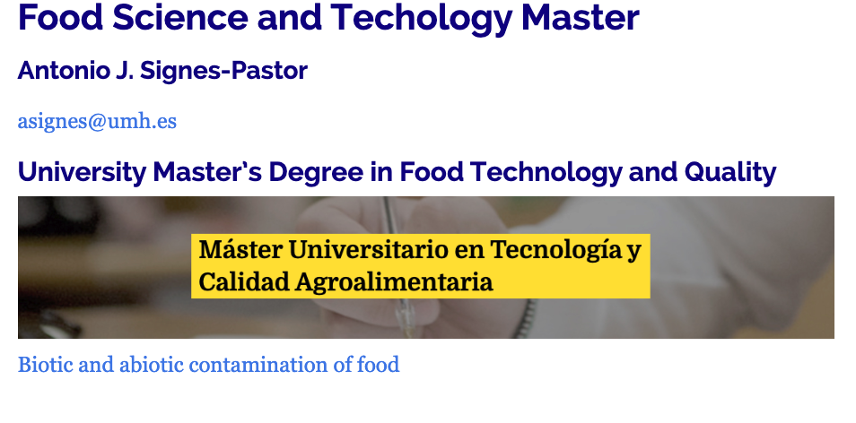
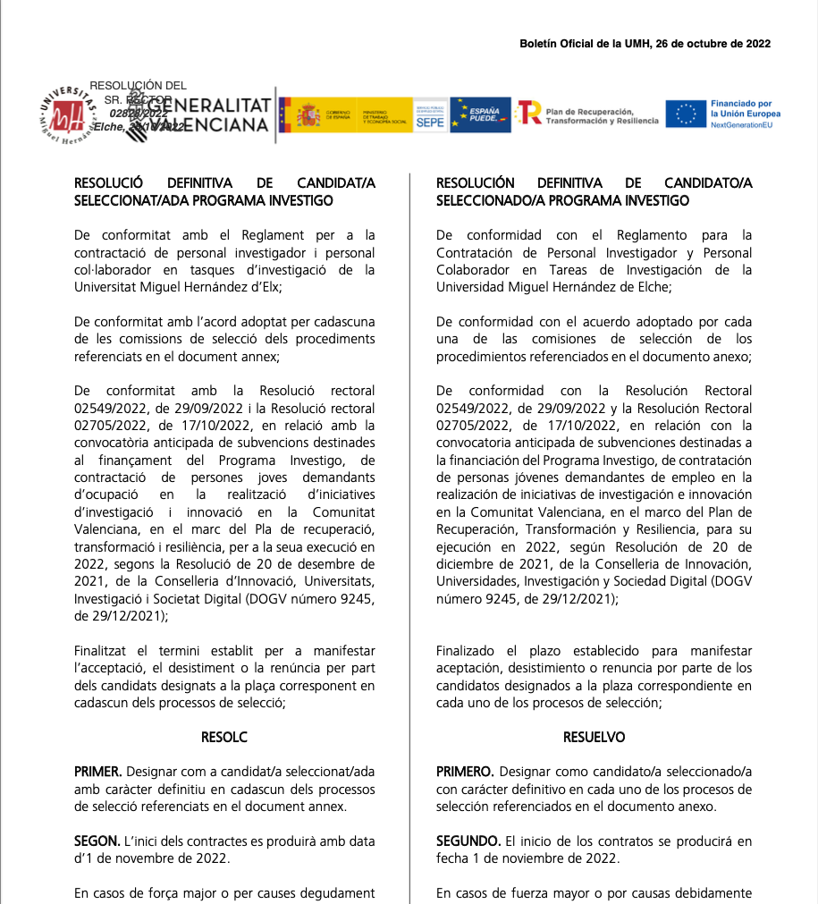
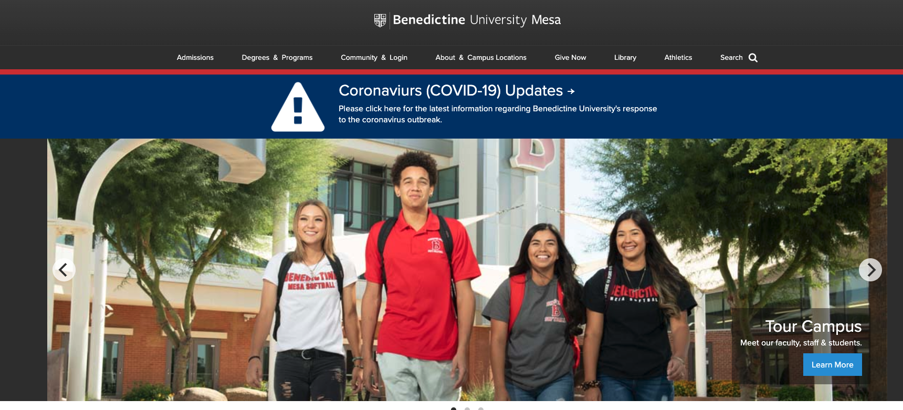
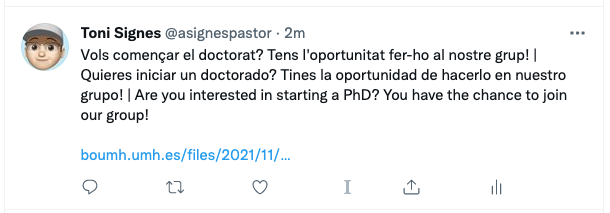

 

 

***Email***: asignes@umh.es

 

---

 

# **Table of content:**

**Jul 2024 [40]**

- **Jul_1**: Reunión grupo CSA

- **Jul_2**: Colaboración proyecto UNISALUD

**Jun 2024 [39]**

- **Jun_1**: Ponencia - Ciclo de conferencias "Alimentos Seguros: Una mirada a la contaminación y seguridad del consumidor"

- **Jun_2**: Jornadas INMA Barcelona

**May 2024 [38]**

- **May_1**: TFM - Máster Salud Pública

**Apr 2024 [37]**

- **Apr_1**: Borrador artículo colaborativo sobre exposión a mercurio

**Mar 2024 [36]**

- **Mar_1**: PREDIMED samples measurements with ICP-MS

**Feb 2024 [35]**

- **Feb_1**: New arsenic speciation method with HPLC-ICP-MS
- **Feb_2**: Study for "Jornadas INMA"
- **Feb_3**: New publication "Pro-vegetarian dietary patterns and essential and heavy metal exposure in children of 4-5-years from the INfancia y medio Ambiente cohort (INMA)"   

**Jan 2024 [34]**

- **Jan_1**: New Publication: "Environmental pollution by heavy metals within the area influenced by the Tungurahua volcano eruption – Ecuador"  

**Dec 2023 [33]**

- **Dec_1**:  New Publication: "Association between Mediterranean diet and metal mixtures concentrations in pregnant people from the New Hampshire Birth Cohort Study".

**Nov 2023 [32]**

- **Nov_1**:  International Webinar organised by "La Escuela superior politécnica de Chimborazo a través del decanato de investigaciones y El Grupo Asociado de Investigación en Biotecnología, Ambiente y Química “GAIBAQ” de la facultad de ciencias."
- **Nov_2**:  Set up arsenic speciation method using HPLC-ICP-MS.

**Oct 2023 [31]**

- **Oct_1**: New publication: "Prenatal exposure to metals mixtures and lung funtion in children from the New Hampshire birth cohort study"
- **Oct_2**: New publication: "Latent childhood exposure to mixtures of metals and neurodevelopmental outcomes in 4-5 year-old children living in Spain"

**Sep 2023 [30]**

* **Sep_1**: XLI Reunión Anual de la Sociedad Española de Epidemiología (SEE)
* **Sep_2**: 35th Annual Conference of the International Society for Environmental Epidemiology (ISEE)
* **Sep_3**: Manuscript acceptance for publication

**Aug 2023 [29]**

* **Aug_1**: Iniciate scoping review about arsenic exposure and neurodevelopment

**Jul 2023 [28]**

* **Jul_1**: ICP-MS analysis
* **Jul_2**: Fundación LAB course

**Jun 2023 [27]**

* **Jun_1**: New publication.
* **Jun_2**: Arsenic speciation equipment set up

**May 2023 [26]**

* **May_1**: ECHO proposal Prenatal exposure to arsenic and lung function in children: An ECHO program study.

**April 2023 [25]**

* **April_1**: Twitter "Empresa-Investigadores Fundación:LAB Mediterráneo"
* **April_2**: ECHO proposal Prenatal Exposure to Arsenic and childhood Neurodevelopment.

**March 2023 [24]**

* **March_1**: Speaker "II Encuentro Empresa-Investigadores Fundación:LAB Mediterráneo"

**February 2023 [23]**

* **February_1**: INMA conference posters presentation

**January 2023 [22]**

* **January_1**: Abstract reviwer for the International Conference and Exhibition for Science
* **January_2**: INMA-Valencia meeting

**December 2022 [21]**

* **December_1**: Outreach activities
* **December_2**: Colaboration project TENDR

**November 2022 [20]**

* **November_1**: Teaching

* **November_2**: Outreach activities

* **November_3**: INVESTIGO

**October 2022 [19]**

* **October_1**: New Publication: Dietary Exposure to Toxic Elements and the Health of Young Children: Methodological Considerations and Data Needs. 
* **October_2**: Start AGROALNEXT.

**September 2022 [18]**

* **September_1**: 34 Annual Conference of International Society of Environmental Epidemiology 18-21 Sept. 2022.

* **September_2**: Trabajo fin de máster - Estudio del contenido de arsénico en alimentos infantiles elaborados a base de arroz.

**August 2022 [17]**

* **August_1**: Paper accepted for publication_01.

* **August_2**: Paper accepted for publication_02.

* **August_3**: ECHO Concept Proposals.

* **August_4**: ISEE poster submition.

**July 2022 [16]**

* **July_1**: Paper accepted for publication
* **July_2**: Open research positions 

**June 2022 [15]**

* **June_1**: Paper accepted for publication
* **June_2**: International Master Food Science and Technology
* **June_3**: ThinkinAzul

**May 2022 [14]**

- **May_1**: Abstract accepted ISEE
- **May_2**: Paper accepted for publication
- **May_3**: Addional samples analysis
- **May_4**: Teaching "Mater in Public Health" 

**April 2022 [13]**

- **Apr_1**: Soil samples Ecuador
- **Apr_2**: Abstracts submition ISEE
   - Arsenic exposure and respiratory outcomes during childhood in the INMA study
   - Associations of Maternal Urinary Arsenic Concentrations during Pregnancy with Infant and Child Mental, Psychomotor, and Cognitive Development: The HOME Study
   - Adherence to Mediterranean diet and metal exposure during childhood in the INMA study
- **Apr_3**: Volunteer ISEE abstract review  

**March 2022 [12]**

* **Mar_1**: Jornadas Científicas CIBERESP 2022  
* **Mar_2**: New publication

**February 2022 [11]**

* **Feb_1**: Teaching statistics at UMH

**January 2022 [10]**

+ **Jan_1**: Became a member of the Steering Committee of INMA (21 January 2022)

**December 2021 [9]**

* **Dec_1**: New publication with PREDIMED-PLUS (13 December 2021)

**November 2021 [8]**

* **Nov_1**: Invited lecturer - Benedictine University Mesa, Arizona, US. (04 November 2021)
* **Nov_2**: Publicación convocatoria predoctoral UMH (17 Noviembre 2021).
* **Nov_3**: Reference to our work during FDA Closer to Zero (18 November 2021).
* **Nov_4**: 17th INfancia y Medio Ambiente (Environmental and Childhood project) Scientific Conferences (23, 24 November 2021).
* **Nov_5**: CUCCAL 14 Programa-Académico Científico (25 Noviembre 2021)

**October 2021 [7]**

* **Oct_1**: International Conference of Water, Energy and Environment for Sustainability (IC-WEES) - Islamabad, Karachi, Tashkent. (27 to 29 October). 

**September 2021 [6]**

- **Sep_1:** Related news. Arsenic levels baby food USA.

- **Sep_2**: Presentació de la Fundación Comunitat Valenciana de Investigació d'Excel·lencia "ValER". (22 September 2021)

- **Sep_3**: ERC "Reading day" - Campus de Espinardo - Universidad de Murcia. (17 September 2021)

* **Sep_4**: Reunión anual de la Sociedad Española de Epidemiología - León (7 al 10 de Septiembre 2021)

**August 2021 [5]**

* **Aug_1**: Paddy field sampling

* **Aug_2**: Presentation. 33rd Anual Conference of the International Society for Environmental Epidemiology_01
* **Aug_3**: Presentation. 33rd Anual Conference of the International Society for Environmental Epidemiology_02

**July 2021 [4]**

* **Jul_1**: Laboratory equipment set up

**June 2021 [3]**

* **Jun_1**: Sample preparation

**May 2021 [2]**

* **May_1**: Publication

**April 2021 [1]**

* **Apr_1**: Start of the project

 

---

 

**Jul_1**: Reunión grupo CSA

**Jul_2**: Colaboración proyecto UNISALU

 

---

 

# **Jun 2024** [39]

**Jun_1**: Ponencia - Ciclo de conferencias "Alimentos Seguros: Una mirada a la contaminación y seguridad del consumidor"

 

---

 

**Jun_2**: Jornadas INMA Barcelona

 

---

 

# **May 2024** [38]

**May_1**: TFM -Máster Salud Publica

 

---

 

# **Mar 2024** [36]

**Apr_1**: Borrador artículo colaborativo sobre exposión a mercurio

 

---

 

# **Mar 2024** [36]

**Mar_1**: PREDIMED samples measurements with ICP-MS

The first completed batch of urine sample measurements for total metal concentrations has been completed.

 

---

 

# **Feb 2024** [35]

**Feb_1**: New arsenic speciation method with HPLC-ICP-MS

 

---

 

**Feb_2**: Study for "Jornadas INMA"

 

---

 

**Feb_3**: New publication "Pro-vegetarian dietary patterns and essential and heavy metal exposure in children of 4-5-years from the INfancia y medio Ambiente cohort (INMA)"   

[Link](https://www.sciencedirect.com/science/article/pii/S1438463924000257)

 

---

 

# **Jan 2024** [34]

**Jan_1**: New Publication: "Environmental pollution by heavy metals within the area influenced by the Tungurahua volcano eruption – Ecuador"  

[link](https://www.sciencedirect.com/science/article/pii/S0147651323014239?via%3Dihub)

# **Dec 2023** [33]

**Dec_1**:  New Publication: "Association between Mediterranean diet and metal mixtures concentrations in pregnant people from the New Hampshire Birth Cohort Study".

[link](https://www.sciencedirect.com/science/article/abs/pii/S0048969723077574)

 

---

 

# **Nov 2023** [32]

## **Nov_1**:  International Webinar organised by "La Escuela superior politécnica de Chimborazo a través del decanato de investigaciones y El Grupo Asociado de Investigación en Biotecnología, Ambiente y Química “GAIBAQ” de la facultad de ciencias."

 

---

 

## **Nov_2**:  Set up arsenic speciation method using HPLC-ICP-MS.

 

---

 

# **Oct 2023** [31]

## **Oct_1**: New publication: "Prenatal exposure to metals mixtures and lung funtion in children from the New Hampshire birth cohort study"

[link](https://www.sciencedirect.com/science/article/pii/S0013935123020388?via%3Dihub)

 

---

 

## **Oct_2**: New publication: "Latent childhood exposure to mixtures of metals and neurodevelopmental outcomes in 4-5 year-old children living in Spain"

[link](https://link.springer.com/article/10.1007/s12403-023-00610-8)

 

---

 

# **Sep 2023** [30]

## **Sep_1**: XLI Reunión Anual de la Sociedad Española de Epidemiología (SEE)

[Reunión Anual](https://www.reunionanualsee.org/)

 

---

 

## **Sep_2**: 35th Annual Conference of the International Society for Environmental Epidemiology (ISEE)

[Annual Conference](https://2023.iseeconference.org/)

 

---

 

## **Sep_3**: Manuscript acceptance for publication

 

---

 

# **Aug 2023** [29]

## Aug_1: Scoping review about arsenic exposure and neurodevelopment.

This review study aims to gather all original studies on arsenic exposure during pregnancy or early childhood and children neuropsychological development.

 

---

 

# **July 2023** [28]

## Jul_1: ICP-MS analysis

 

---

 

## Jul_2: Fundación LAB Course

 

---

 

# **June 2023** [27]

## Jun_1: New publication

[Link](https://www.sciencedirect.com/science/article/pii/S0013935123013129?via%3Dihub)

 

---

 

## **Jun_2**: Arsenic speciation equipment set up

 

---

 

# **May 2023** [26]

## ECHO proposal Prenatal exposure to arsenic and lung function in children: An ECHO program study

Accepted scientific article proposal with title "ECHO proposal Prenatal exposure to arsenic and lung function in children: An ECHO program study"

 

---

 

# **April 2023** [25]

## Twitter "Empresa-Investigadores Fundación:LAB Mediterráneo"

https://twitter.com/FundacionLAB/status/1645142019889680384

## ECHO proposal Prenatal Exposure to Arsenic and childhood Neurodevelopment

Accepted scientific article proposal with title "Pre- and postnatal arsenic exposure, arsenic methylation efficiency, and childhood neurodevelopment: An ECHO program study"

 

---

 

# **March 2023** [24]

## Seminar - Fundación:LAB Mediterráneo

[Fundación:LAB Mediterráneo](https://www.fundacionlab.es/encuentro-conectando-empresarios-investigadores-2023/)

 

---

 

# **February 2023** [23]

## INMA Conference posters presentation

 

---

 

# **January 2023** [22]

## Abstract reviwer for the International Conference and Exhibition for Science

https://www.ices-ksa.org/

## INMA-Valencia meeting

FISABIO-Salud Pública
Avenida de Cataluña nº 21
46020
Valencia

 

---

 

# **December 2022** [21]

## Boletín INMA

## 

## Collaborator project TNDR

https://projecttendr.com/

 

---

 

# **November 2022** [20]

## Teaching

 

 

## Outreach activities

 

### I Young Researchers Meeting CIBERESP-BBN in Barcelona, 21-22 November

 

### Infografía

 

### Boletín INMA

 

## INVESTIGO

 

---

 

# **October 2022** [19]

## New Publication

[Access publication](https://academic.oup.com/jn/advance-article-abstract/doi/10.1093/jn/nxac185/6748278?redirectedFrom=fulltext&login=false)

## Start AGROALNEXT

[web](https://tonis81.github.io/HidroSOStoneFruit/)

 

---

 

# **September 2022** [18]

## 34 Annual Conference of International Society of Environmental Epidemiology

## Trabajo fin de máster - Estudio del contenido de arsénico en alimentos infantiles elaborados a base de arroz

 

---

 

# **August 2022** [17]

## Paper accepted for publication 01

The manuscript entitled "**Dietary exposure to toxic elements and the health of young children: methodological considerations and data needs**" has been accepted for publication in The Journal of Nutrition.

## Paper accepted for publication 02

The manuscript entitled "**Arsenic exposure and respiratory outcomes during childhood in the INMA study**" has been accepted for publication in PLOS ONE.

## ECHO Concept Proposals

The following Concept Proposals (Step 1) have been submuted to use ECHO data:

1. **Prenatal exposure to arsenic and lung function in children: An ECHO program study**
2. **Pre- and postnatal arsenic exposure, arsenic methylation efficiency, and childhood neurodevelopment: An ECHO program study**
3. **Trace elements, metals and metalloids and early childhood growth**
4. **Exposure to essential and non-essential elements during weaning – A validation study**

## ISEE posters

 

 

 

---

 

# **July 2022** [16]

## Paper accepted for publication

 

## Open research position

\> Oportunidad para desarrollar actividades de investigación sobre seguridad alimentaria y epidemiología de los elementos traza en la Universidad Miguel Hernández. Si cumples los requisitos y estás interesado no dudes en ponerte en contacto y enviarnos el CV. 

\> Oportunitat per desenvolupar activitat d'investigació sobre seguretat alimentària y epidemiologia dels elements traça a la Universitat Miguel Hernández. Si compleixes amb els requisits i estàs interessat no dubtes a contactar i enviar-nos el CV.

\> Research position on food safety and trace metal epidemiology at the Miguel Hernández University. If you meet the requirements and are interested, do not hesitate to contact us, and send us your CV.

[Details](https://drive.google.com/file/d/12MYErp9lTh5wMqtsjiS1ukoZD4XvGN2V/view?usp=sharing)

 

---

 

# **June 2022** [15]

## Paper accepted for publication

https://www.sciencedirect.com/science/article/pii/S0013935122009343?via%3Dihub

## International Master Food Science and Technology

Colaboration with International Master in Food Science and Technology

## ThinkinAzul

 

---

 

# **May 2022** [14]

# Abstracts submition ISEE

# Paper accepted for publication

# Addional samples analysis

Continue analysing arsenic speciation in urine samples

# Teaching "Master in Public Health"

https://rpubs.com/ToniSignes/881320 

https://rpubs.com/ToniSignes/881323

https://rpubs.com/ToniSignes/881324 

 

---

 

# **April 2022** [13]

# Soil samples Ecuador

Full scan analysis of soil samples from Ecuador.

# Abstracts submition ISEE

1. Arsenic exposure and respiratory outcomes during childhood in the INMA study

2. Associations of Maternal Urinary Arsenic Concentrations during Pregnancy with Infant and Child Mental, Psychomotor, and Cognitive Development: The HOME Study

3. Adherence to Mediterranean diet and metal exposure during childhood in the INMA study

# Volunteer ISEE abstract review 

 

---

 

# **March 2022** [12]

## Jornadas Científicas CIBERESP 2022

## New publication

 

---

 

# **February 2022** [11]

## Teaching advance statistics at UMH

* How to install R - https://rpubs.com/ToniSignes/862089
* Introduction to linear regression - https://rpubs.com/ToniSignes/862100
* Example of multiple lienear regression with R using NHANES data - https://rpubs.com/ToniSignes/863500

 

---

 

# **January 2022** [10]

 

## **Jan_1**: Became a member of the Steering Committee of INMA (21 January 2022)

[Click here](https://www.proyectoinma.org/proyecto-inma/organizacion/)

 

---

 

# **December 2021** [9]

 

## New publication with PREDIMED-PLUS (13 December 2021)

[Click here](https://www.frontiersin.org/articles/10.3389/fnagi.2021.782067/full)

 

---

 

# **November 2021** [8]

 

## **Nov_1**: Invited lecturer - Benedictine University Mesa, Arizona, US (November 04, 2021).

 

 

## **Nov_2**: Convocatoria contrato predoctoral (17 noviembre 2021).

[Detalles de la convocatoria](https://boumh.umh.es/resolucion-rectoral-04802-2021-de-17-de-noviembre-por-la-que-se-convoca-un-contrato-predoctoral-en-el-ambito-de-un-proyecto-de-investigacion-ref-238-21/)

 

## Nov_3: FDA Closer to Zero. References to our work (18 noviembre 2021).

[Youtube video here](https://www.youtube.com/watch?v=Sb9Uhiq6Hv4)

 

## Nov_4: 17th INfancia y Medio Ambiente (Environmental and Childhood project) Scientific Conferences (23, 24 November 2021).

 

 

 

 

 

## **Nov_5**: CUCCAL 14 Programa-Académico Científico (25 Noviembre 2021)

 

 

---

 

# **October 2021** [7]

 

## **Oct_1**: International Conference of Water, Energy and Environment for Sustainability (IC-WEES) - Islamabad, Karachi, Tashkent. 27 to 29 October. 

[Access information](https://icwees.nust.edu.pk/)

 

Invited speaker "Global-Scale Arsenic pollution and its potential effects on children under 3 years of age"

 

---

 

# **September 2021** [6]

 

## Sep_1: Related news. Arsenic levels baby food USA.

[Access information](https://oversight.house.gov/sites/democrats.oversight.house.gov/files/ECP%20Second%20Baby%20Food%20Report%209.29.21%20FINAL.pdf)

 

[Access information](https://www.cbsnews.com/video/new-report-finds-high-levels-of-toxic-heavy-metals-in-baby-food/?utm_source=dlvr.it&utm_medium=twitter#x)

 

[Access information](https://edition.cnn.com/2020/08/06/health/arsenic-infant-rice-cereal-fda-wellness/index.html)

 

[Access information](https://edition.cnn.com/2021/09/29/health/baby-food-toxins-update-wellness/index.html)

 

# Sep_2: Presentació de la Fundación Comunitat Valenciana de Investigació d'Excel·lencia "ValER"

 

*Castelló, 17 September 2021*. It has been a great pleasure to attend the presentation of ValER by the President of the Valencian Community, meet colleagues of the PlanGent and others. I am also very proud of having a picture of myself with Prof. Angel Carbonell, the director of Science and Research in the Valencian Community.  

 

 

# Sep_3: ERC "Reading day" - Campus de Espinardo - Universidad de Murcia

 

 

## Sep_4: Reunión anual de la Sociedad Española de Epidemiología - 

## León, 7 al 10 de Septiembre 2021

 

[SEE-León](https://www.reunionanualsee.org/)

 

 

 

---

 

# **August 2021** [5]

 

## Aug_1: Paddy field sample collection

> Paddy field soil sample collection. Supporting colleagues’ research project. The beginning of a new research proposal.

 

## Aug_2: Abstract presentation [ISEE](https://www.isee2021.org/). Prenatal exposure to metal mixtures and lung function in children from the New Hampshire Birth Cohort Study

 

**Antonio Jose Signes Pastor**,  Jesús Vioque, Margaret Guill, Juliette Madan, Emily Baker, Brian Jackson, and Margaret R. Karagas

 

**Prenatal exposure to metal mixtures and lung function in children from the New Hampshire Birth Cohort Study**

 

**Abstract**. BACKGROUND AND AIM: Prenatal environmental exposure to metals and metalloids (referred to as “metals”) has been associated with childhood lung development, but limited data exist on metal mixtures. We aimed to investigate the association between gestational exposure to metal mixtures and childhood lung function among 267 maternal-child dyads from the New Hampshire Birth Cohort Study. METHODS: Maternal ~24-28-week gestational urinary arsenic speciation, aluminum, cadmium, cobalt, chromium, copper, iron, mercury, manganese, molybdenum, nickel, tin, lead, antimony, selenium, thallium, uranium, vanadium and zinc concentration were assessed using inductively coupled plasma mass spectroscopy (ICP-MS). Forced vital capacity (FVC), forced expiratory volume in the first second of exhalation (FEV1), and forced expiratory flow between 25% and 75% of FVC (FEF25-75) standardized z-scores were obtained at a median age of 7.4 years. We used quantile g-computation for each outcome and urinary metals adjusted for maternal smoking status, children’s age, sex and height. RESULTS:Urinary concentrations of cobalt, lead, nickel, cadmium, and chromium were inversely associated with lung function z-scores. Arsenic concentrations were inverse associated specifically with FVC and FEV1 z-scores. In contrast, lung function z-scores increased with vanadium, molybdenum, and thallium urine concentrations. CONCLUSIONS:Our findings suggest that prenatal exposure to metal mixtures impact lung function, with varying direction and magnitudes of effects. KEYWORDS: mixture, heavy metals, children’s environmental health, respiratory outcomes, biomarkers of exposure

 

[abstract](https://ehp.niehs.nih.gov/doi/10.1289/isee.2021.P-105)

 

---

## Aug_3: Abstract presentation [ISEE](https://www.isee2021.org/). Dietary exposure to metal mixtures throughout infants' first year of life in the New Hampshire Birth Cohort Study

 

**Antonio Jose Signes Pastor**,  Brian Jackson, Kathryn L. Cottingham, and Margaret R. Karagas.

 

**Dietary exposure to metal mixtures throughout infants' first year of life in the New Hampshire Birth Cohort Study**

 

**Abstract**. BACKGROUND AND AIM: Recent reports have raised concerns about infants’ exposure to metals and metalloids (here, “metals”) via their first solid foods. Although early exposure to metals may cause lifelong health effects, epidemiologic studies on infants' dietary exposure to metal mixtures are still scarce. We aimed to assess the impact of diet on urinary metal concentrations over the first year of life among 348 children from the New Hampshire Birth Cohort Study. METHODS: We used inductively coupled plasma mass spectroscopy (ICP-MS) to measure infant urinary arsenic speciation, cadmium, cobalt, chromium, copper, iron, mercury, manganese, molybdenum, lead, antimony, selenium, uranium, vanadium and zinc concentrations. Caregivers completed a 3-day food diary before infant urine collection at 6 weeks and 4, 6, and 12 months of age. RESULTS:We determined the weights of each metal and the impact of the mixture at 6 weeks and 12 months of age. Using quantile g-computation we found that urinary concentration of arsenic, molybdenum and cobalt increased from ~6 weeks to 12 months of age, and that urinary selenium and copper decreased. We observed similar findings in a subset of infants (n = 19) during weaning from 4 to 6 months of age. We are now focusing on identifying specific groups of foods responsible for these changes. CONCLUSIONS:Determining dietary contributors to infants’ exposure to potential harmful metals is a critical step in preventing their long-term consequences. KEYWORDS: mixture, heavy metals, food, biomarkers of exposure

 

[Abstract](https://ehp.niehs.nih.gov/doi/10.1289/isee.2021.P-159)

 

---

 

---

 

# **July 2021** [4]

## Jul_1: New ICP-MS set up.

 

---

 

# **June 2021** [3]

## Jun_1: Urine sample cataloguing and preparation for analysis

 

> Processing INMA urine samples to determine bulk metals analysis and arsenic speciation. 

 

---

 

# **May 2021** [2]

 

## May_1: Publication: Prenatal exposure to arsenic and lung function in children from the New Hampshire Birth Cohort Study

 

**Antonio J. Signes-Pastor**, Pablo Martinez-Camblor, Emily Baker, Juliette Madan, Margaret F. Guill, Margaret R. Karagas,

 

 **Prenatal exposure to arsenic and lung function in children from the New Hampshire Birth Cohort Study**, 

 

Environment International, Volume 155, 2021, 106673, ISSN 0160-4120,

 

**Abstract**: Prenatal arsenic exposure is associated with an increased risk of lung cancer along with multiple non-carcinogenic outcomes, including respiratory diseases in arsenic-contaminated areas. Limited epidemiologic data exist on whether in utero arsenic exposure influences lung development and subsequent respiratory health. We investigated the association between gestational arsenic exposure and childhood lung function in the New Hampshire Birth Cohort Study. Urinary arsenic speciation including inorganic arsenic (iAs), monomethylarsonic acid (MMA), dimethylarsinic acid (DMA) and arsenobetaine was measured in maternal urine samples collected during pregnancy and spirometry was performed in offspring at a median age of 7.4 years. Forced vital capacity (FVC), forced expiratory volume in the first second of exhalation (FEV1), and forced expiratory flow between 25% and 75% of FVC (FEF25-75) standardized z-scores were assessed in linear models as dependent variables with the log2-transformed summation of urinary arsenic species (ΣAs = iAs + MMA + DMA) corrected for specific gravity as an independent variable and with adjustment for maternal smoking status, children’s age, sex and height. Among the 358 children in the study, a doubling of ΣAs was associated with a −0.08 (ß) decrease in FVC z-scores (95% confidence interval (CI) from −0.14 to −0.01) and −0.10 (ß) (95% CI from −0.18 to −0.02) decrease in FEV1 z-scores. The inverse association appeared stronger among those mothers with lower secondary methylation index (urinary DMA/MMA), especially among girls. No association was observed for FEF25-75 z-scores. Our results suggest that gestation arsenic exposure at levels relevant to the general US population during the vulnerable period of lung formation may adversely affect lung function in childhood.

**Keywords**: Children; Lung capacity; Arsenic speciation; Gestational exposure; Spirometry

 

[doi](https://doi.org/10.1016/j.envint.2021.106673); [web](https://www.sciencedirect.com/science/article/pii/S0160412021002981)

 

---

 

# **April 2021** [1]

 

## Apr_1: Exposure to arsenic in the presence of other metals, metabolism and health effects in childhood and adolescence (ARSENCIA)

